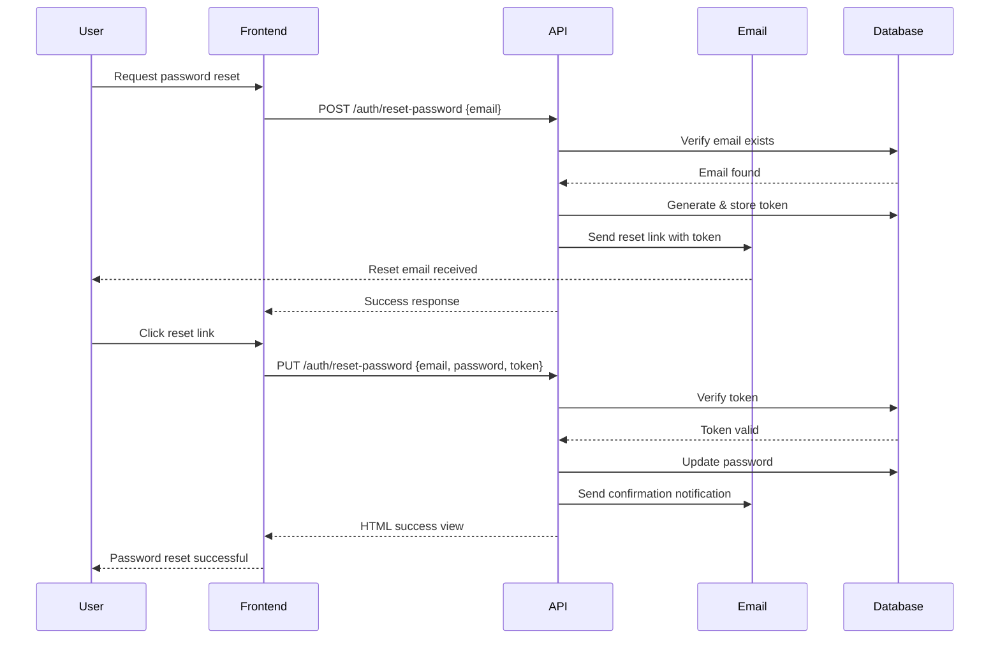

## Overview

The password reset process consists of two steps:

1. **Send Reset Link** - Request a password reset link via email
2. **Reset Password** - Submit new password with the reset token

<Note>
  Both endpoints do not require authentication (unauthenticated).
</Note>

## Step 1: Send Reset Link

### Endpoint

```
POST /auth/reset-password
```

Send a password reset link to the user's email address.

### Request Body

<ParamField path="email" type="string" required>
  User's email address. Must exist in the system.
  
  **Validation**: `required|email|exists:users,email`
</ParamField>

### Code Examples

<CodeGroup>

```bash cURL
curl -X POST "https://api.servitech.com/auth/reset-password" \
  -H "Content-Type: application/json" \
  -H "Accept: application/json" \
  -d '{
    "email": "john@example.com"
  }'
```

```javascript JavaScript
const response = await fetch('https://api.servitech.com/auth/reset-password', {
  method: 'POST',
  headers: {
    'Content-Type': 'application/json',
    'Accept': 'application/json'
  },
  body: JSON.stringify({
    email: 'john@example.com'
  })
});

const data = await response.json();

if (data.success) {
  console.log('Password reset link sent to email');
}
```

```python Python
import requests
import json

url = 'https://api.servitech.com/auth/reset-password'
headers = {
    'Content-Type': 'application/json',
    'Accept': 'application/json'
}
payload = {
    'email': 'john@example.com'
}

response = requests.post(url, headers=headers, data=json.dumps(payload))
data = response.json()

if data['success']:
    print('Password reset link sent to email')
```

```php PHP
<?php

$url = 'https://api.servitech.com/auth/reset-password';
$data = ['email' => 'john@example.com'];

$options = [
    'http' => [
        'header'  => "Content-Type: application/json\r\n" .
                     "Accept: application/json\r\n",
        'method'  => 'POST',
        'content' => json_encode($data)
    ]
];

$context  = stream_context_create($options);
$response = file_get_contents($url, false, $context);
$result = json_decode($response, true);

if ($result['success']) {
    echo "Password reset link sent to email\n";
}
```

</CodeGroup>

### Success Response

**HTTP Status**: `200 OK`

```json
{
  "success": true,
  "message": "We have emailed your password reset link!"
}
```

### Error Responses

#### Validation Error - Email Required

**HTTP Status**: `422 Unprocessable Entity`

```json
{
  "success": false,
  "message": "The given data was invalid.",
  "errors": {
    "email": [
      "The email field is required."
    ]
  }
}
```

#### Validation Error - Invalid Email Format

**HTTP Status**: `422 Unprocessable Entity`

```json
{
  "success": false,
  "message": "The given data was invalid.",
  "errors": {
    "email": [
      "The email must be a valid email address."
    ]
  }
}
```

#### Validation Error - Email Not Found

**HTTP Status**: `422 Unprocessable Entity`

```json
{
  "success": false,
  "message": "The given data was invalid.",
  "errors": {
    "email": [
      "The selected email is invalid."
    ]
  }
}
```

#### Email Send Failure

**HTTP Status**: `500 Internal Server Error`

Returned when the email cannot be sent (e.g., mail server issues).

**Source**: `AuthController.php:182-183`

```json
{
  "success": false,
  "message": "Unable to send password reset link. Please try again later."
}
```

### Implementation Details

The send reset link process (from `AuthController.php:160-184`):

1. **Validate Email** - Ensures email exists in the database
2. **Generate Token** - Creates a unique reset token
3. **Send Email** - Dispatches password reset email via Laravel's Password facade
4. **Return Response** - Confirms email was sent

**Source Code Reference**: `AuthController.php:160-184`

```php
public function sendResetLink(Request $request): JsonResponse
{
    $request->validate([
        'email' => 'required|email|exists:users,email'
    ]);

    $status = Password::sendResetLink(
        $request->only('email')
    );

    $sent = $status === Password::RESET_LINK_SENT;
    return $sent
        ? ApiResponse::success(status: Response::HTTP_OK, message: __('passwords.sent'))
        : ApiResponse::error(status: Response::HTTP_INTERNAL_SERVER_ERROR, message: __('passwords.not_sent'));
}
```

---

## Step 2: Reset Password

### Endpoint

```
PUT /auth/reset-password
```

Reset the user's password using the token received via email.

<Warning>
  This endpoint returns an HTML view, not a JSON response. It's designed to be accessed through a web browser via the email link.
</Warning>

### Request Body

<ParamField path="email" type="string" required>
  User's email address.
  
  **Validation**: `required|email`
</ParamField>

<ParamField path="password" type="string" required>
  New password. Minimum 8 characters. Must be confirmed.
  
  **Validation**: `required|confirmed|min:8`
</ParamField>

<ParamField path="password_confirmation" type="string" required>
  Password confirmation. Must match the `password` field.
  
  **Validation**: Must match `password` field
</ParamField>

<ParamField path="token" type="string" required>
  The reset token received via email.
  
  **Validation**: `required`
</ParamField>

### Code Examples

<CodeGroup>

```bash cURL
curl -X PUT "https://api.servitech.com/auth/reset-password" \
  -H "Content-Type: application/json" \
  -H "Accept: application/json" \
  -d '{
    "email": "john@example.com",
    "password": "NewSecurePass123",
    "password_confirmation": "NewSecurePass123",
    "token": "a7b3c9d1e5f2g8h4i6j0k2l4m6n8p0q2"
  }'
```

```javascript JavaScript
// Extract token from URL (typically in email link)
const urlParams = new URLSearchParams(window.location.search);
const token = urlParams.get('token');
const email = urlParams.get('email');

const response = await fetch('https://api.servitech.com/auth/reset-password', {
  method: 'PUT',
  headers: {
    'Content-Type': 'application/json',
    'Accept': 'application/json'
  },
  body: JSON.stringify({
    email: email,
    password: 'NewSecurePass123',
    password_confirmation: 'NewSecurePass123',
    token: token
  })
});

// Note: Response will be HTML, not JSON
const html = await response.text();
```

```python Python
import requests
import json

url = 'https://api.servitech.com/auth/reset-password'
headers = {
    'Content-Type': 'application/json',
    'Accept': 'application/json'
}
payload = {
    'email': 'john@example.com',
    'password': 'NewSecurePass123',
    'password_confirmation': 'NewSecurePass123',
    'token': 'a7b3c9d1e5f2g8h4i6j0k2l4m6n8p0q2'
}

response = requests.put(url, headers=headers, data=json.dumps(payload))

# Note: Response will be HTML, not JSON
html = response.text
```

</CodeGroup>

### Success Response

**HTTP Status**: `200 OK`

**Content-Type**: `text/html`

Returns an HTML view (`auth.reset-password`) with a success message.

**Source**: `AuthController.php:252`

The view includes:
- Success message: "Your password has been reset!"
- Notification sent to user's email confirming password change

### Error Responses

#### Invalid User

**HTTP Status**: `200 OK`

**Content-Type**: `text/html`

Returns HTML view with error message.

**Error Message**: "We can't find a user with that email address."

**Source**: `AuthController.php:227`

#### Invalid Token

**HTTP Status**: `200 OK`

**Content-Type**: `text/html`

Returns HTML view with error message.

**Error Message**: "This password reset token is invalid."

**Source**: `AuthController.php:228`

#### Token Expired

Reset tokens expire after a configured time period (typically 60 minutes).

**Error Message**: "This password reset token is invalid." (same as invalid token)

#### Validation Errors

**HTTP Status**: `422 Unprocessable Entity`

Returned when request data fails validation.

```json
{
  "success": false,
  "message": "The given data was invalid.",
  "errors": {
    "password": [
      "The password must be at least 8 characters.",
      "The password confirmation does not match."
    ],
    "token": [
      "The token field is required."
    ]
  }
}
```

### Implementation Details

The password reset process (from `AuthController.php:198-253`):

1. **Validate Request** - Validates email, password, confirmation, and token
2. **Verify Token** - Checks if token is valid and not expired
3. **Reset Password** - Updates user's password with bcrypt hashing
4. **Generate Remember Token** - Creates new remember token for the user
5. **Fire Event** - Triggers `PasswordReset` event
6. **Send Notification** - Emails user confirming password change
7. **Return View** - Displays success or error message

**Source Code Reference**: `AuthController.php:198-253`

```php
public function resetPassword(ResetPasswordRequest $request): View
{
    $resetUser = null;

    $status = Password::reset(
        $request->validated(),
        function ($user, $password) use (&$resetUser) {
            $resetUser = $user;
            
            $user->forceFill([
                'password' => bcrypt($password)
            ])->setRememberToken(Str::random(60));

            $user->save();
            event(new PasswordReset($user));
        }
    );

    $message = match ($status) {
        Password::PASSWORD_RESET => __('passwords.reset'),
        Password::INVALID_USER => __('passwords.user'),
        Password::INVALID_TOKEN => __('passwords.token'),
        default => __('passwords.failed'),
    };

    $type = match ($status) {
        Password::PASSWORD_RESET => MessageResponse::TYPE_SUCCESS,
        default => MessageResponse::TYPE_ERROR,
    };

    if ($status === Password::PASSWORD_RESET && $resetUser) {
        $resetUser->notify(new PasswordResetSuccessNotification());
    }

    $message = MessageResponse::create($message, $type);
    return view('auth.reset-password', compact('message'));
}
```

<Note>
  After successful password reset, users receive a confirmation email via `PasswordResetSuccessNotification`. This helps detect unauthorized password changes.
</Note>

## Password Reset Flow Diagram



## Token Security

### Token Expiration

Password reset tokens expire after a configured time period (default: 60 minutes). This is configured in `config/auth.php`:

```php
'passwords' => [
    'users' => [
        'provider' => 'users',
        'table' => 'password_reset_tokens',
        'expire' => 60,  // minutes
        'throttle' => 60,  // seconds between requests
    ],
],
```

### Token Storage

Tokens are stored in the `password_reset_tokens` table with:
- Email address
- Hashed token
- Creation timestamp

### Rate Limiting

Password reset requests are throttled to prevent abuse:
- **Throttle**: 60 seconds between requests for the same email
- Prevents spam and brute force attacks

<Warning>
  Reset tokens are single-use. After successful password reset, the token is deleted from the database and cannot be reused.
</Warning>

## Best Practices

<AccordionGroup>
  <Accordion title="Secure token transmission" icon="shield">
    Always send password reset links via HTTPS. Never transmit tokens over unencrypted connections.
  </Accordion>
  
  <Accordion title="Use short expiration times" icon="clock">
    Keep token expiration times short (30-60 minutes) to minimize the window for token abuse.
  </Accordion>
  
  <Accordion title="Notify users of password changes" icon="bell">
    Always send confirmation emails after successful password resets to alert users of potential unauthorized access.
  </Accordion>
  
  <Accordion title="Implement rate limiting" icon="gauge-high">
    Throttle password reset requests to prevent abuse and protect user accounts.
  </Accordion>
  
  <Accordion title="Generic error messages" icon="message">
    Consider using generic error messages (e.g., "If that email exists, we've sent a reset link") to prevent user enumeration.
  </Accordion>
</AccordionGroup>

## Common Issues

### Email Not Received

**Possible causes:**
- Email in spam folder
- Invalid email configuration on server
- Email service rate limits
- Email doesn't exist in system

**Solutions:**
- Check spam/junk folder
- Verify SMTP configuration
- Contact system administrator

### Token Expired

**Cause**: Token older than configured expiration time (default: 60 minutes)

**Solution**: Request a new password reset link

### Invalid Token

**Possible causes:**
- Token already used
- Token manually modified
- Token from different environment

**Solution**: Request a new password reset link

## Related Endpoints

<CardGroup cols={2}>
  <Card title="Login" icon="right-to-bracket" href="/authentication/login">
    Login after resetting password
  </Card>
  <Card title="Register" icon="user-plus" href="/authentication/register">
    Create a new account
  </Card>
  <Card title="Update Password" icon="key" href="/api/user/update-password">
    Change password while authenticated
  </Card>
</CardGroup>
