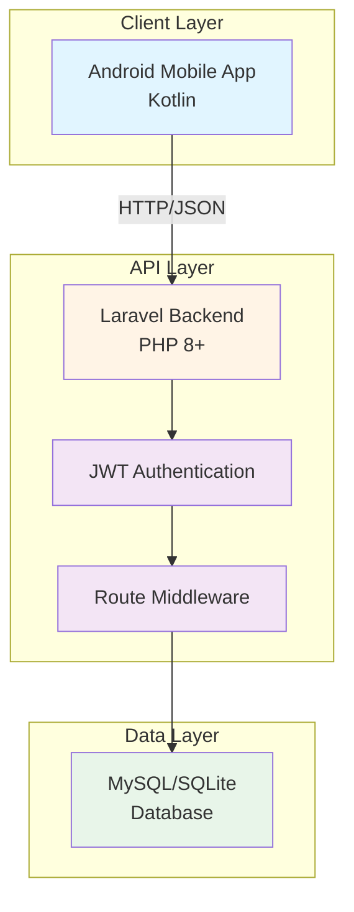
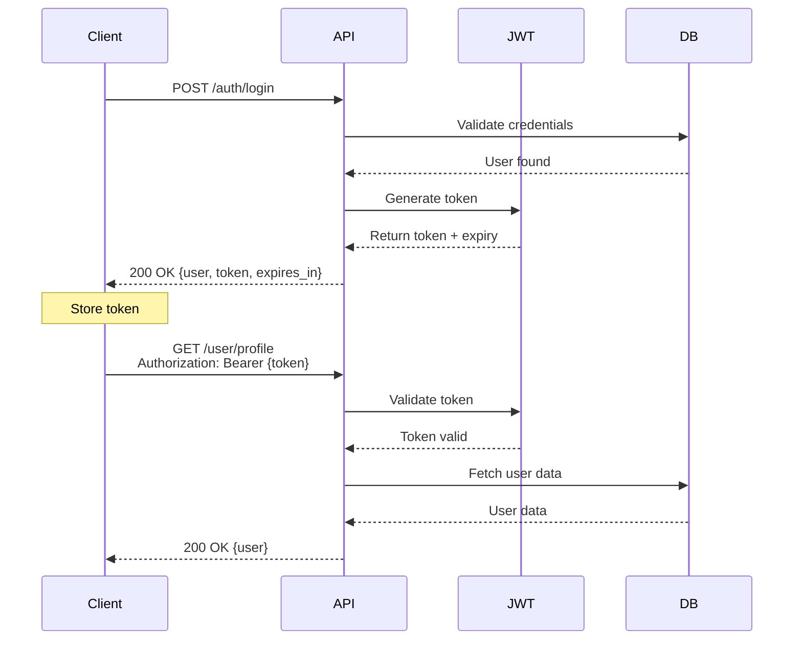

## Overview

ServITech is a REST API backend built with Laravel 12 that manages quotations for technology and anime products, as well as technical support requests. The system follows a three-tier architecture pattern with clear separation of concerns.

## System Components

## Architecture Layers

### 1. Client Layer

The system is designed to be consumed by:
- **Android Mobile Application**: Built with Kotlin, provides the user interface
- **Third-party clients**: Any HTTP client can interact with the API using standard REST conventions

### 2. API Layer (Laravel Backend)

The core backend is organized into several key components:

#### Controllers

Located in `app/Http/Controllers/`, controllers handle incoming requests:

- **AuthController** (`app/Http/Controllers/Auth/AuthController.php:35`) - User authentication (login, register, password reset)
- **UserController** (`app/Http/Controllers/UserController.php:18`) - User profile management
- **ArticleController** - Technology and anime product management
- **CategoryController** - Product category management (admin only)
- **SubcategoryController** - Product subcategory management
- **SupportRequestController** - Technical support ticket handling
- **RepairRequestController** - Repair request management (admin only)

#### Responses

Standardized response classes in `app/Http/Responses/`:

- **ApiResponse** (`app/Http/Responses/ApiResponse.php:8`) - Unified JSON response format for success and error states
- **MessageResponse** (`app/Http/Responses/MessageResponse.php:5`) - User-facing message formatting

#### Routing

API routes are defined in `routes/api.php:27` with the following structure:

- **Public routes**: Authentication endpoints, article browsing
- **Protected routes** (`auth:api` middleware): User profile, support requests
- **Admin routes** (`role:admin` middleware): Category management, repair requests

<Info>
All routes are localized using the `localizedGroup()` helper, automatically adapting responses to the client's preferred language.
</Info>

### 3. Data Layer

The system supports two database engines:

- **MySQL**: Recommended for production deployments
- **SQLite**: Used for development and testing

Data is managed through:
- **Eloquent ORM**: Laravel's database abstraction layer
- **Migrations**: Version-controlled database schema
- **Seeders**: Initial data population

## Key Technologies

| Technology | Version | Purpose |
|------------|---------|----------|
| PHP | 8+ | Server-side language |
| Laravel | 12 | Web application framework |
| JWT Auth | Latest | Token-based authentication |
| Spatie Permission | Latest | Role and permission management |
| Scramble (Dedoc) | Latest | API documentation generation |
| MySQL/SQLite | Latest | Data persistence |

## Authentication Flow

## Request/Response Flow

1. **Client sends request** with optional `Accept-Language` header
2. **Localization middleware** sets the application locale based on:
   - URL parameter
   - Cookie value
   - Session value  
   - `Accept-Language` header (e.g., `en`, `es`)
3. **Authentication middleware** (if protected route) validates JWT token
4. **Authorization middleware** (if admin route) checks user role
5. **Controller** processes the request and calls business logic
6. **Response** is formatted using `ApiResponse` and returned as JSON

## Configuration Files

Key configuration files in `config/`:

- `app.php` - Application settings, locale configuration
- `auth.php` - Authentication guards and providers
- `jwt.php` - JWT authentication settings
- `permission.php` - Spatie permission package configuration
- `localization.php` - Multi-language routing and translation settings
- `database.php` - Database connection configuration

## Development Environment

The project uses:

- **Composer**: PHP dependency management
- **NPM**: Frontend asset management
- **Artisan**: Laravel's command-line tool
- **Git Flow**: Branching strategy (`main` for production, `dev` for development)

<Note>
The application uses environment variables (`.env` file) for configuration. Never commit sensitive credentials to version control.
</Note>

## Scalability Considerations

The architecture supports:

- **Horizontal scaling**: Stateless JWT authentication allows multiple API servers
- **Caching**: Laravel's cache system for permissions and translations (24-hour default)
- **Queue system**: Background job processing for emails and notifications
- **Database replication**: Support for read/write splitting

## API Documentation

Live API documentation is automatically generated at `${APP_URL}/docs/api` using Scramble, providing:

- Interactive endpoint testing
- Request/response examples
- Authentication requirements
- Validation rules

## Next Steps

<CardGroup cols={2}>
  <Card title="Authorization" icon="shield-check" href="/concepts/authorization">
    Learn about the role-based access control system
  </Card>
  <Card title="Localization" icon="language" href="/concepts/localization">
    Understand multi-language support
  </Card>
  <Card title="Error Handling" icon="triangle-exclamation" href="/concepts/error-handling">
    Explore error response formats
  </Card>
  <Card title="Authentication" icon="key" href="/authentication/overview">
    Deep dive into JWT authentication
  </Card>
</CardGroup>