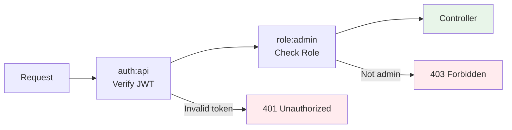
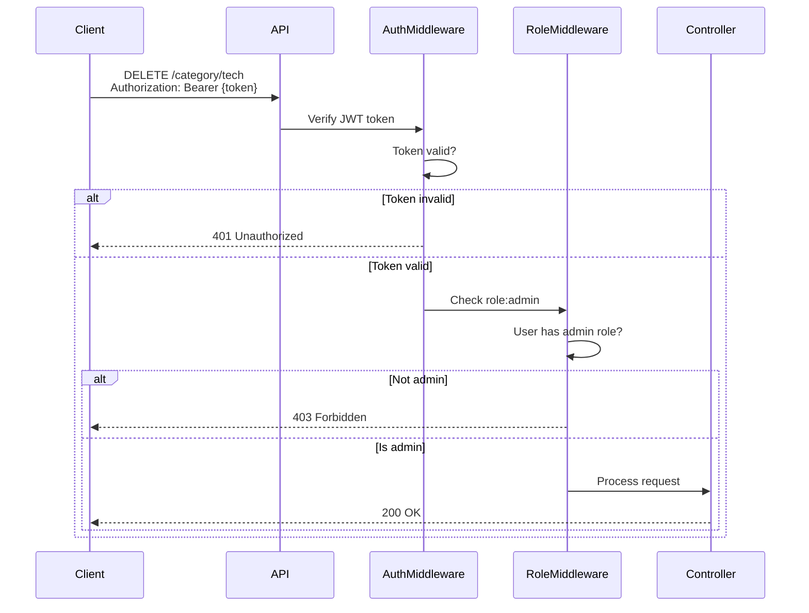

## Overview

ServITech implements a role-based access control (RBAC) system to manage user permissions and restrict access to specific endpoints. The system uses the **Spatie Permission** package to assign roles to users and protect routes based on those roles.

## User Roles

The application defines three distinct user roles in `app/Enums/UserRoles.php:5`:

```php
enum UserRoles: string
{
    case ADMIN = 'admin';
    case EMPLOYEE = 'employee';
    case USER = 'user';
}
```

### Role Descriptions

<CardGroup cols={3}>
  <Card title="User" icon="user">
    Default role for registered users. Can access public content and manage their own profile and support requests.
  </Card>
  <Card title="Employee" icon="user-tie">
    Extended permissions for staff members. (Currently defined but not actively used in route protection)
  </Card>
  <Card title="Admin" icon="shield-halved">
    Full system access. Can manage categories, repair requests, and all administrative functions.
  </Card>
</CardGroup>

## Role Assignment

New users are automatically assigned the `USER` role upon registration:

```php
// app/Http/Controllers/Auth/AuthController.php:137
$user = User::create($request->validated());
$user->assignRole(UserRoles::USER);
```

<Note>
Role assignment during registration ensures all users have appropriate base permissions. Admin and Employee roles must be manually assigned through database operations or admin interfaces.
</Note>

## Route Protection

Routes are protected using Laravel middleware defined in `routes/api.php`.

### Public Routes

Accessible to all users without authentication:

```php
// Authentication endpoints
Route::prefix('auth')->group(function () {
    Route::post('login', [AuthController::class, 'login']);
    Route::post('register', [AuthController::class, 'register']);
    Route::post('reset-password', [AuthController::class, 'sendResetLink']);
    Route::put('reset-password', [AuthController::class, 'resetPassword']);
});

// Article browsing (read-only)
Route::prefix('articles')->group(function () {
    Route::get('', [ArticleController::class, 'index']);
    Route::get('{article:category}', [ArticleController::class, 'show']);
    Route::get('id/{article}', [ArticleController::class, 'showById']);
});
```

### Authenticated Routes

Require valid JWT token (`auth:api` middleware):

```php
// routes/api.php:57
Route::middleware('auth:api')->group(function () {
    // Support requests - available to all authenticated users
    Route::prefix('support-request')->group(function () {
        Route::get('', [SupportRequestController::class, 'index']);
        Route::post('', [SupportRequestController::class, 'store']);
        Route::get('{supportRequest}', [SupportRequestController::class, 'show']);
        Route::put('{supportRequest}', [SupportRequestController::class, 'update']);
        Route::delete('{supportRequest}', [SupportRequestController::class, 'destroy']);
    });

    // User profile management
    Route::prefix('user')->group(function () {
        Route::get('profile', [UserController::class, 'profile']);
        Route::put('profile', [UserController::class, 'updateBasicInformation']);
        Route::put('password', [UserController::class, 'updatePassword']);
    });
});
```

### Admin-Only Routes

Require both authentication and `admin` role:

```php
// routes/api.php:75
Route::middleware("role:" . UserRoles::ADMIN->value)->group(function () {
    // Category management (admin only)
    Route::prefix('category')->group(function () {
        Route::get('', [CategoryController::class, 'index']);
        Route::post('', [CategoryController::class, 'store']);
        Route::get('{category:name}', [CategoryController::class, 'show']);
        Route::put('{category:name}', [CategoryController::class, 'update']);
        Route::delete('{category:name}', [CategoryController::class, 'destroy']);
    });

    // Repair request management (admin only)
    Route::prefix('repair-request')->group(function () {
        Route::get('', [RepairRequestController::class, 'index']);
        Route::post('', [RepairRequestController::class, 'store']);
        Route::get('{repairRequest:receipt_number}', [RepairRequestController::class, 'show']);
        Route::put('{repairRequest:receipt_number}', [RepairRequestController::class, 'update']);
        Route::delete('{repairRequest:receipt_number}', [RepairRequestController::class, 'destroy']);
    });
});
```

## Middleware Chain

Admin routes use a middleware chain:



<Warning>
Admin routes are nested inside the `auth:api` middleware group. A user must be authenticated BEFORE role verification occurs.
</Warning>

## Spatie Permission Package

The system uses [spatie/laravel-permission](https://spatie.be/docs/laravel-permission) for role management.

### Configuration

Key settings from `config/permission.php:3`:

```php
'models' => [
    'permission' => Spatie\Permission\Models\Permission::class,
    'role' => Spatie\Permission\Models\Role::class,
],

'table_names' => [
    'roles' => 'roles',
    'permissions' => 'permissions',
    'model_has_permissions' => 'model_has_permissions',
    'model_has_roles' => 'model_has_roles',
    'role_has_permissions' => 'role_has_permissions',
],

'cache' => [
    'expiration_time' => \DateInterval::createFromDateString('24 hours'),
    'key' => 'spatie.permission.cache',
    'store' => 'default',
],
```

### Key Features

- **Role caching**: Permissions are cached for 24 hours to improve performance
- **Automatic cache invalidation**: Cache is flushed when roles/permissions are updated
- **Multiple role assignment**: Users can have multiple roles (though this API typically assigns one)

## Checking Permissions in Code

While the current implementation primarily uses route middleware, you can also check permissions programmatically:

### Check User Role

```php
use App\Enums\UserRoles;

// Check if user has a specific role
if (auth()->user()->hasRole(UserRoles::ADMIN->value)) {
    // Admin-specific logic
}

// Check if user has any of the given roles
if (auth()->user()->hasAnyRole([UserRoles::ADMIN->value, UserRoles::EMPLOYEE->value])) {
    // Staff logic
}

// Check if user has all given roles
if (auth()->user()->hasAllRoles([UserRoles::USER->value])) {
    // Logic
}
```

### Check in Blade Views

```php
@role('admin')
    <!-- Admin-only content -->
@endrole

@hasrole('user')
    <!-- User content -->
@endhasrole
```

### Assign/Remove Roles

```php
use App\Enums\UserRoles;

// Assign a role
$user->assignRole(UserRoles::ADMIN->value);

// Remove a role
$user->removeRole(UserRoles::USER->value);

// Sync roles (removes all others)
$user->syncRoles([UserRoles::ADMIN->value]);
```

## Authorization Flow



## Error Responses

### 401 Unauthorized - Missing or Invalid Token

```json
{
  "status": 401,
  "message": "Unauthenticated.",
  "errors": {}
}
```

### 403 Forbidden - Insufficient Permissions

```json
{
  "status": 403,
  "message": "This action is unauthorized.",
  "errors": {}
}
```

<Info>
Error messages are localized based on the `Accept-Language` header. See [Localization](/concepts/localization) for details.
</Info>

## Protected Endpoints Summary

| Endpoint Pattern | Authentication | Role Required | Purpose |
|------------------|----------------|---------------|----------|
| `/auth/*` | No | None | Login, register, password reset |
| `/articles` (GET) | No | None | Browse products |
| `/user/*` | Yes | Any | Profile management |
| `/support-request/*` | Yes | Any | Support tickets |
| `/category/*` | Yes | Admin | Category management |
| `/repair-request/*` | Yes | Admin | Repair orders |
| `/articles` (POST/PUT/DELETE) | Varies | Varies | Article management |

## Best Practices

<AccordionGroup>
  <Accordion title="Always use enum values for role names">
    Use `UserRoles::ADMIN->value` instead of hardcoded strings to prevent typos and enable refactoring.
    
    ```php
    // Good
    Route::middleware("role:" . UserRoles::ADMIN->value)
    
    // Bad
    Route::middleware("role:admin")
    ```
  </Accordion>
  
  <Accordion title="Nest role middleware inside auth middleware">
    Role checks require an authenticated user. Always place role middleware after authentication.
    
    ```php
    Route::middleware('auth:api')->group(function () {
        Route::middleware("role:admin")->group(function () {
            // Admin routes
        });
    });
    ```
  </Accordion>
  
  <Accordion title="Cache permissions in production">
    The Spatie package caches permissions by default. Don't disable caching in production environments.
  </Accordion>
  
  <Accordion title="Use descriptive role names in translations">
    Role names are translated using the `__('enums.user_roles.{role}')` pattern for user-facing displays.
  </Accordion>
</AccordionGroup>

## Database Schema

The Spatie Permission package creates these tables:

- `roles` - Stores role definitions
- `model_has_roles` - Pivot table linking users to roles
- `permissions` - Stores granular permissions (not currently used)
- `role_has_permissions` - Links permissions to roles
- `model_has_permissions` - Direct user permissions (not currently used)

<Note>
The current implementation uses role-based routing. The permission system is available for future granular access control if needed.
</Note>

## Next Steps

<CardGroup cols={2}>
  <Card title="Authentication" icon="key" href="/authentication/overview">
    Learn how JWT tokens are generated and validated
  </Card>
  <Card title="Error Handling" icon="triangle-exclamation" href="/concepts/error-handling">
    Understand authorization error responses
  </Card>
</CardGroup>