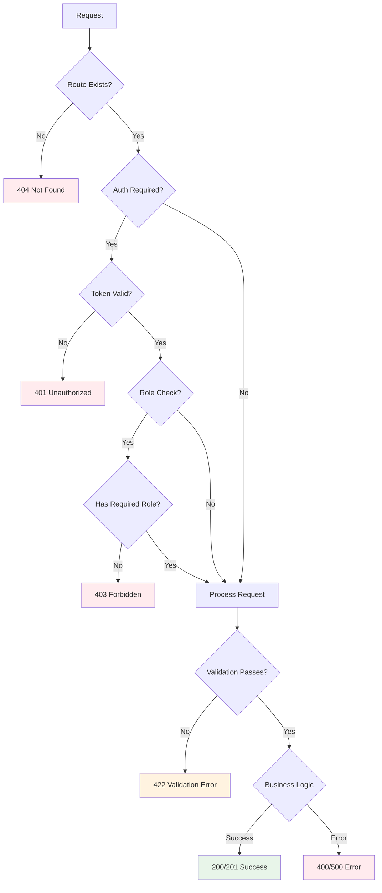

## Overview

ServITech uses a standardized error response format across all API endpoints to ensure consistent error handling on the client side. All errors return structured JSON responses with appropriate HTTP status codes and localized error messages.

## Response Format

The API uses the `ApiResponse` class (`app/Http/Responses/ApiResponse.php:8`) to generate consistent error responses.

### Success Response Structure

```json
{
  "status": 200,
  "message": "Operation completed successfully.",
  "data": {
    "user": {
      "id": 1,
      "name": "John Doe",
      "email": "john@example.com"
    }
  }
}
```

### Error Response Structure

```json
{
  "status": 400,
  "message": "Human-readable error description",
  "errors": {
    "field_name": [
      "Specific error message for this field"
    ]
  }
}
```

<Info>
When there are no specific field errors, the `errors` object will be empty: `{}`
</Info>

## ApiResponse Class

The centralized response handler provides two static methods:

### Success Response

```php
// app/Http/Responses/ApiResponse.php:18
public static function success(
    array $data = [], 
    int $status = Response::HTTP_OK, 
    string $message = null
): JsonResponse {
    if ($message === null) {
        $message = __('http-statuses.200');
    }
    return response()->json([
        'status' => $status,
        'message' => $message,
        'data' => empty($data) ? (object)[] : $data,
    ], $status);
}
```

**Usage:**

```php
return ApiResponse::success(
    message: __('messages.user.logged_in'),
    data: ['user' => UserResource::make($user)]
);
```

### Error Response

```php
// app/Http/Responses/ApiResponse.php:37
public static function error(
    string $message = 'Error', 
    array $errors = [], 
    int $status = Response::HTTP_BAD_REQUEST
): JsonResponse {
    return response()->json([
        'status' => $status,
        'message' => $message,
        'errors' => empty($errors) ? (object)[] : $errors,
    ], $status);
}
```

**Usage:**

```php
return ApiResponse::error(
    status: Response::HTTP_NOT_FOUND,
    message: __('messages.common.not_found', ['item' => 'Article']),
    errors: ['id' => 'Article with this ID does not exist']
);
```

## HTTP Status Codes

The API uses standard HTTP status codes from `Symfony\Component\HttpFoundation\Response`:

### Success Codes (2xx)

| Code | Constant | Usage |
|------|----------|-------|
| 200 | `HTTP_OK` | Successful GET, PUT, DELETE operations |
| 201 | `HTTP_CREATED` | Successful POST operations creating new resources |

### Client Error Codes (4xx)

| Code | Constant | Usage |
|------|----------|-------|
| 400 | `HTTP_BAD_REQUEST` | General client error, invalid data |
| 401 | `HTTP_UNAUTHORIZED` | Missing or invalid authentication token |
| 403 | `HTTP_FORBIDDEN` | Insufficient permissions (wrong role) |
| 404 | `HTTP_NOT_FOUND` | Resource not found |
| 422 | `HTTP_UNPROCESSABLE_ENTITY` | Validation errors |

### Server Error Codes (5xx)

| Code | Constant | Usage |
|------|----------|-------|
| 500 | `HTTP_INTERNAL_SERVER_ERROR` | Unexpected server errors |

## Common Error Scenarios

### 1. Authentication Errors (401)

#### Missing Token

```bash
GET /api/user/profile
```

```json
{
  "status": 401,
  "message": "Unauthenticated.",
  "errors": {}
}
```

#### Invalid Credentials

```bash
POST /api/auth/login
Content-Type: application/json

{
  "email": "user@example.com",
  "password": "wrongpassword"
}
```

```json
{
  "status": 401,
  "message": "These credentials do not match our records.",
  "errors": {
    "password": "These credentials do not match our records."
  }
}
```

**Implementation:**

```php
// app/Http/Controllers/Auth/AuthController.php:94
return ApiResponse::error(
    status: Response::HTTP_UNAUTHORIZED,
    message: __('auth.password'),
    errors: ['password' => __('auth.password')]
);
```

#### User Not Found

```json
{
  "status": 400,
  "message": "We can't find a user with that email address.",
  "errors": {
    "email": "We can't find a user with that email address."
  }
}
```

**Implementation:**

```php
// app/Http/Controllers/Auth/AuthController.php:83
return ApiResponse::error(
    status: Response::HTTP_BAD_REQUEST,
    message: __('passwords.user'),
    errors: ['email' => __('passwords.user')]
);
```

### 2. Authorization Errors (403)

```bash
DELETE /api/category/tech
Authorization: Bearer {user_token}
```

```json
{
  "status": 403,
  "message": "This action is unauthorized.",
  "errors": {}
}
```

<Note>
This error occurs when a non-admin user attempts to access admin-only routes like `/category/*` or `/repair-request/*`.
</Note>

### 3. Validation Errors (422)

```bash
POST /api/auth/register
Content-Type: application/json

{
  "email": "invalid-email",
  "password": "123"
}
```

```json
{
  "status": 422,
  "message": "The email field must be a valid email address. (and 1 more error)",
  "errors": {
    "email": [
      "The email field must be a valid email address."
    ],
    "password": [
      "The password field must be at least 8 characters."
    ]
  }
}
```

<Info>
Validation errors are automatically handled by Laravel's `FormRequest` classes and return 422 status codes with detailed field-level errors.
</Info>

### 4. Resource Not Found (404)

```bash
GET /api/articles/id/99999
```

```json
{
  "status": 404,
  "message": "Article not found.",
  "errors": {}
}
```

### 5. Already Logged Out (401)

```bash
POST /api/auth/logout
Authorization: Bearer {expired_or_invalid_token}
```

```json
{
  "status": 401,
  "message": "User is already logged out.",
  "errors": {}
}
```

**Implementation:**

```php
// app/Http/Controllers/Auth/AuthController.php:267
if (!auth()->check()) {
    return ApiResponse::error(
        message: __('messages.user.already_logged_out'),
        status: Response::HTTP_UNAUTHORIZED
    );
}
```

### 6. Password Reset Failures (500)

```bash
POST /api/auth/reset-password
Content-Type: application/json

{
  "email": "user@example.com"
}
```

```json
{
  "status": 500,
  "message": "We were unable to send the password reset link.",
  "errors": {}
}
```

**Implementation:**

```php
// app/Http/Controllers/Auth/AuthController.php:180
$sent = $status === Password::RESET_LINK_SENT;
return $sent
    ? ApiResponse::success(status: Response::HTTP_OK, message: __('passwords.sent'))
    : ApiResponse::error(status: Response::HTTP_INTERNAL_SERVER_ERROR, message: __('passwords.not_sent'));
```

## Error Handling Flow



## Localized Error Messages

All error messages are localized based on the `Accept-Language` header.

### English Error

```bash
POST /api/auth/login
Accept-Language: en
Content-Type: application/json

{"email": "wrong@test.com", "password": "wrong"}
```

```json
{
  "status": 400,
  "message": "We can't find a user with that email address.",
  "errors": {
    "email": "We can't find a user with that email address."
  }
}
```

### Spanish Error

```bash
POST /api/auth/login
Accept-Language: es
Content-Type: application/json

{"email": "wrong@test.com", "password": "wrong"}
```

```json
{
  "status": 400,
  "message": "No podemos encontrar un usuario con esa dirección de correo electrónico.",
  "errors": {
    "email": "No podemos encontrar un usuario con esa dirección de correo electrónico."
  }
}
```

See [Localization](/concepts/localization) for more details on multi-language support.

## Message Response Types

For frontend message display, the `MessageResponse` class provides type constants:

```php
// app/Http/Responses/MessageResponse.php:7
class MessageResponse
{
    public const TYPE_ERROR = 'error';
    public const TYPE_SUCCESS = 'success';
    public const TYPE_WARNING = 'warning';
    public const TYPE_INFO = 'info';

    public static function create(string $title, string $type): array
    {
        return [
            'title' => $title,
            'type' => $type,
        ];
    }
}
```

**Usage (for HTML views):**

```php
// app/Http/Controllers/Auth/AuthController.php:237
$type = match ($status) {
    Password::PASSWORD_RESET => MessageResponse::TYPE_SUCCESS,
    default => MessageResponse::TYPE_ERROR,
};

$message = MessageResponse::create($message, $type);
return view('auth.reset-password', compact('message'));
```

## Error Handling Best Practices

<AccordionGroup>
  <Accordion title="Always use appropriate HTTP status codes">
    Don't return 200 OK for error conditions. Use the correct 4xx or 5xx status code.
    
    ```php
    // Good
    return ApiResponse::error(
        status: Response::HTTP_NOT_FOUND,
        message: 'Resource not found'
    );
    
    // Bad
    return ApiResponse::success(
        message: 'Resource not found',
        data: []
    );
    ```
  </Accordion>
  
  <Accordion title="Provide specific error messages">
    Give users enough information to fix the issue without exposing sensitive details.
    
    ```php
    // Good
    'errors' => ['email' => 'User with this email does not exist']
    
    // Bad (too vague)
    'errors' => ['error' => 'Something went wrong']
    
    // Bad (too detailed/security risk)
    'errors' => ['db' => 'MySQL connection failed: host=192.168.1.1']
    ```
  </Accordion>
  
  <Accordion title="Use localized error messages">
    Always use translation keys instead of hardcoded strings.
    
    ```php
    // Good
    message: __('messages.common.not_found', ['item' => 'Article'])
    
    // Bad
    message: 'Article not found'
    ```
  </Accordion>
  
  <Accordion title="Include field-level errors for validation">
    Map validation errors to specific fields so clients can highlight problem areas.
    
    ```php
    'errors' => [
        'email' => ['Email is required', 'Email must be valid'],
        'password' => ['Password must be at least 8 characters']
    ]
    ```
  </Accordion>
  
  <Accordion title="Keep error responses consistent">
    Always return the same structure: `{status, message, errors}` for all errors.
  </Accordion>
</AccordionGroup>

## Error Response Examples by Endpoint

### Authentication Endpoints

#### POST `/auth/login`

```json
// Success (200)
{
  "status": 200,
  "message": "User logged in successfully.",
  "data": {
    "user": {...},
    "token": "eyJ0eXAiOiJKV1QiLCJhbGc...",
    "expires_in": 3600
  }
}

// Invalid credentials (401)
{
  "status": 401,
  "message": "These credentials do not match our records.",
  "errors": {
    "password": "These credentials do not match our records."
  }
}

// User not found (400)
{
  "status": 400,
  "message": "We can't find a user with that email address.",
  "errors": {
    "email": "We can't find a user with that email address."
  }
}
```

#### POST `/auth/register`

```json
// Success (201)
{
  "status": 201,
  "message": "User registered successfully.",
  "data": {
    "user": {...}
  }
}

// Validation error (422)
{
  "status": 422,
  "message": "The email has already been taken.",
  "errors": {
    "email": ["The email has already been taken."]
  }
}
```

#### POST `/auth/logout`

```json
// Success (200)
{
  "status": 200,
  "message": "User logged out successfully.",
  "data": {}
}

// Already logged out (401)
{
  "status": 401,
  "message": "User is already logged out.",
  "errors": {}
}
```

### Protected Endpoints

#### GET `/user/profile`

```json
// Success (200)
{
  "status": 200,
  "message": "User information retrieved successfully.",
  "data": {
    "user": {...}
  }
}

// Unauthenticated (401)
{
  "status": 401,
  "message": "Unauthenticated.",
  "errors": {}
}
```

#### PUT `/user/profile`

```json
// Success (200)
{
  "status": 200,
  "message": "User information updated successfully.",
  "data": {
    "user": {...}
  }
}

// Validation error (422)
{
  "status": 422,
  "message": "The email has already been taken.",
  "errors": {
    "email": ["The email has already been taken."]
  }
}
```

### Admin-Only Endpoints

#### DELETE `/category/tech`

```json
// Success (200)
{
  "status": 200,
  "message": "Category deleted successfully.",
  "data": {}
}

// Forbidden - not admin (403)
{
  "status": 403,
  "message": "This action is unauthorized.",
  "errors": {}
}

// Not found (404)
{
  "status": 404,
  "message": "Category not found.",
  "errors": {}
}
```

## Testing Error Responses

When testing your client application, simulate these common error scenarios:

```bash
# 401 - Missing token
curl http://localhost:8000/api/user/profile

# 401 - Invalid credentials
curl -X POST http://localhost:8000/api/auth/login \
  -H "Content-Type: application/json" \
  -d '{"email":"wrong@test.com","password":"wrong"}'

# 403 - Insufficient permissions
curl -X DELETE http://localhost:8000/api/category/tech \
  -H "Authorization: Bearer {user_token}"

# 422 - Validation error
curl -X POST http://localhost:8000/api/auth/register \
  -H "Content-Type: application/json" \
  -d '{"email":"invalid","password":"123"}'

# 404 - Not found
curl http://localhost:8000/api/articles/id/99999
```

## Next Steps

<CardGroup cols={2}>
  <Card title="Authentication" icon="key" href="/authentication/overview">
    Learn about JWT authentication and token handling
  </Card>
  <Card title="Authorization" icon="shield-check" href="/concepts/authorization">
    Understand role-based access control
  </Card>
  <Card title="Localization" icon="language" href="/concepts/localization">
    See how error messages are localized
  </Card>
  <Card title="API Reference" icon="book" href="/api-reference/introduction">
    Explore all API endpoints and their error responses
  </Card>
</CardGroup>