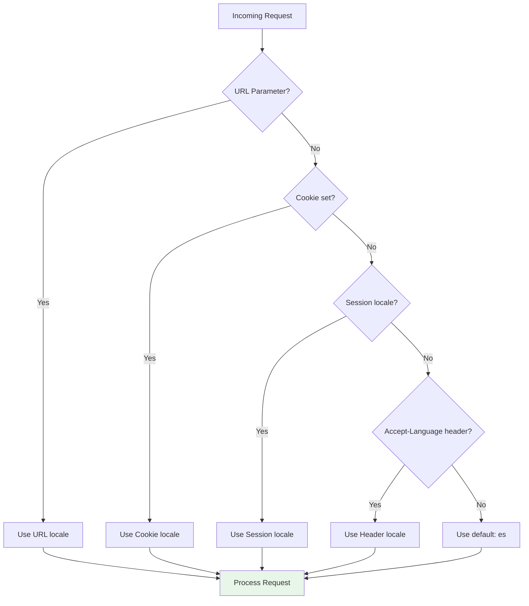
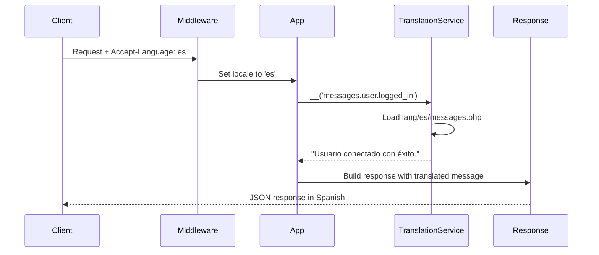

## Overview

ServITech provides comprehensive multi-language support for all API responses, error messages, and user-facing content. The system automatically adapts to the client's preferred language using Laravel's localization features enhanced by the `LaravelLang` package.

## Supported Languages

The API currently supports:

- **English (en)** - Default fallback language
- **Spanish (es)** - Primary language (default locale)

<Info>
The default locale is set to Spanish (`es`) as specified in the `.env` file: `APP_LOCALE=es`. English serves as the fallback when translations are missing.
</Info>

## Language Detection

The API detects the client's preferred language through multiple methods, checked in this order:



### 1. URL Parameter (Highest Priority)

```bash
GET /api/articles?locale=en
```

### 2. Cookie

```bash
Cookie: Accept-Language=es
```

### 3. Session

Session value `Accept-Language`

### 4. HTTP Header (Most Common)

```bash
GET /api/articles
Accept-Language: es
```

or

```bash
Accept-Language: en
```

### 5. Default Locale

If none of the above are provided, the API falls back to the configured default (`es`).

## Configuration

Localization settings are defined in `config/localization.php:8` and `config/app.php:81`.

### Application Locale Settings

```php
// config/app.php
'locale' => env('APP_LOCALE', 'en'),
'fallback_locale' => env('APP_FALLBACK_LOCALE', 'en'),
'faker_locale' => env('APP_FAKER_LOCALE', 'en_US'),
```

### Route Configuration

```php
// config/localization.php
'routes' => [
    'names' => [
        'parameter' => 'locale',           // URL parameter name
        'header'    => 'Accept-Language',  // HTTP header name
        'cookie'    => 'Accept-Language',  // Cookie name
        'session'   => 'Accept-Language',  // Session key
    ],
    
    'name_prefix' => 'localized.',
    'redirect_default' => false,
    'hide_default' => false,
],
```

### Middleware Chain

All API routes use the `localizedGroup()` helper which applies these middleware in order:

```php
// config/localization.php:147
'middlewares' => [
    'default' => [
        LaravelLang\Routes\Middlewares\LocalizationByCookie::class,
        LaravelLang\Routes\Middlewares\LocalizationByHeader::class,
        LaravelLang\Routes\Middlewares\LocalizationBySession::class,
        LaravelLang\Routes\Middlewares\LocalizationByModel::class,
    ],
],
```

## Localized Routes

All API routes are wrapped in the `localizedGroup()` helper:

```php
// routes/api.php:27
Route::localizedGroup(function () {
    // Authentication Routes
    Route::prefix('auth')->group(function () {
        Route::post('login', [AuthController::class, 'login']);
        Route::post('register', [AuthController::class, 'register']);
        // ...
    });
    
    // All other routes...
});
```

<Note>
The `localizedGroup()` helper automatically applies localization middleware to all routes within the group, eliminating the need for manual middleware assignment on each route.
</Note>

## Translation Files

Translation files are organized by language in the `lang/` directory:

```
lang/
├── en/
│   ├── actions.php
│   ├── auth.php
│   ├── http-statuses.php
│   ├── messages.php
│   ├── pagination.php
│   ├── passwords.php
│   └── validation.php
├── es/
│   ├── actions.php
│   ├── auth.php
│   ├── http-statuses.php
│   ├── messages.php
│   ├── pagination.php
│   ├── passwords.php
│   └── validation.php
├── en.json
└── es.json
```

### Translation Structure

Translations use a nested array structure for organization:

```php
// lang/en/messages.php
return [
    'common' => [
        'not_found' => ':item not found.',
        'created' => ':item created successfully.',
        'updated' => ':item updated successfully.',
        'deleted' => ':item deleted successfully.',
    ],
    
    'entities' => [
        'article' => [
            'plural' => 'Articles',
            'singular' => 'Article',
        ],
        'user' => [
            'plural' => 'Users',
            'singular' => 'User',
        ],
    ],
    
    'user' => [
        'registered' => 'User registered successfully.',
        'logged_in' => 'User logged in successfully.',
        'logged_out' => 'User logged out successfully.',
    ],
];
```

```php
// lang/es/messages.php
return [
    'common' => [
        'not_found' => ':item no encontrado.',
        'created' => ':item creado exitosamente.',
        'updated' => ':item actualizado exitosamente.',
        'deleted' => ':item eliminado exitosamente.',
    ],
    
    'entities' => [
        'article' => [
            'plural' => 'Artículos',
            'singular' => 'Artículo',
        ],
        'user' => [
            'plural' => 'Usuarios',
            'singular' => 'Usuario',
        ],
    ],
    
    'user' => [
        'registered' => 'Usuario registrado con éxito.',
        'logged_in' => 'Usuario conectado con éxito.',
        'logged_out' => 'Usuario desconectado con éxito.',
    ],
];
```

## Using Translations

### In Controllers

The `__()` helper function retrieves translated strings:

```php
// app/Http/Controllers/Auth/AuthController.php:110
return ApiResponse::success(
    message: __('messages.user.logged_in'),
    data: [
        'user' => UserResource::make($user),
        'token' => $token,
        'expires_in' => $expiresIn
    ]
);
```

### With Placeholders

Use `:placeholder` syntax for dynamic values:

```php
// Translation file
'not_found' => ':item not found.'

// Usage
__('messages.common.not_found', ['item' => 'Article'])
// Output (en): "Article not found."
// Output (es): "Artículo no encontrado."
```

### Nested Keys

Access nested translations with dot notation:

```php
__('messages.common.created')        // "created successfully"
__('messages.entities.user.plural')  // "Users" or "Usuarios"
__('auth.password')                  // "These credentials do not match our records."
```

## Response Examples

### Success Response (English)

```bash
GET /api/user/profile
Accept-Language: en
Authorization: Bearer {token}
```

```json
{
  "status": 200,
  "message": "User information retrieved successfully.",
  "data": {
    "user": {
      "id": 1,
      "name": "John Doe",
      "email": "john@example.com"
    }
  }
}
```

### Success Response (Spanish)

```bash
GET /api/user/profile
Accept-Language: es
Authorization: Bearer {token}
```

```json
{
  "status": 200,
  "message": "Información del usuario obtenida con éxito.",
  "data": {
    "user": {
      "id": 1,
      "name": "John Doe",
      "email": "john@example.com"
    }
  }
}
```

### Error Response (English)

```bash
POST /api/auth/login
Accept-Language: en
Content-Type: application/json

{
  "email": "wrong@example.com",
  "password": "wrongpassword"
}
```

```json
{
  "status": 400,
  "message": "We can't find a user with that email address.",
  "errors": {
    "email": "We can't find a user with that email address."
  }
}
```

### Error Response (Spanish)

```bash
POST /api/auth/login
Accept-Language: es
Content-Type: application/json

{
  "email": "wrong@example.com",
  "password": "wrongpassword"
}
```

```json
{
  "status": 400,
  "message": "No podemos encontrar un usuario con esa dirección de correo electrónico.",
  "errors": {
    "email": "No podemos encontrar un usuario con esa dirección de correo electrónico."
  }
}
```

## Validation Errors

Validation errors are also fully localized:

```bash
POST /api/auth/register
Accept-Language: es
Content-Type: application/json

{
  "email": "invalid-email",
  "password": "123"
}
```

```json
{
  "status": 422,
  "message": "The email field must be a valid email address.",
  "errors": {
    "email": [
      "El campo email debe ser una dirección de correo válida."
    ],
    "password": [
      "El campo password debe contener al menos 8 caracteres."
    ]
  }
}
```

## Enum Localization

Enums like `UserRoles` have translated labels:

```php
// app/Enums/UserRoles.php:18
public function label(): string
{
    return match ($this) {
        self::ADMIN => __('enums.user_roles.admin'),
        self::EMPLOYEE => __('enums.user_roles.employee'),
        self::USER => __('enums.user_roles.user'),
    };
}
```

Translation files:

```php
// lang/en/enums.php
'user_roles' => [
    'admin' => 'Administrator',
    'employee' => 'Employee',
    'user' => 'User',
]

// lang/es/enums.php
'user_roles' => [
    'admin' => 'Administrador',
    'employee' => 'Empleado',
    'user' => 'Usuario',
]
```

## Adding New Languages

<Steps>
  <Step title="Install language pack">
    ```bash
    composer require laravel-lang/lang:~14.0
    php artisan lang:add {locale}
    ```
  </Step>
  
  <Step title="Create translation files">
    Create a new directory in `lang/` with the locale code:
    ```bash
    mkdir lang/fr
    cp lang/en/*.php lang/fr/
    ```
  </Step>
  
  <Step title="Translate strings">
    Update all translation files in the new language directory.
  </Step>
  
  <Step title="Test localization">
    ```bash
    curl -H "Accept-Language: fr" http://localhost:8000/api/articles
    ```
  </Step>
</Steps>

## Best Practices

<AccordionGroup>
  <Accordion title="Always use translation keys, never hardcoded strings">
    ```php
    // Good
    return ApiResponse::success(message: __('messages.user.logged_in'));
    
    // Bad
    return ApiResponse::success(message: 'User logged in successfully');
    ```
  </Accordion>
  
  <Accordion title="Use placeholders for dynamic content">
    ```php
    // Translation: ':item created successfully.'
    __('messages.common.created', ['item' => $entityName])
    ```
  </Accordion>
  
  <Accordion title="Keep translation keys organized and consistent">
    Group related translations under common keys:
    - `messages.common.*` - Reusable messages
    - `messages.entities.*` - Entity names
    - `messages.{entity}.*` - Entity-specific messages
  </Accordion>
  
  <Accordion title="Provide fallback translations">
    Always define translations in both the default locale and fallback locale to prevent missing translation errors.
  </Accordion>
  
  <Accordion title="Test with both languages">
    Include localization tests in your test suite:
    ```php
    $this->withHeaders(['Accept-Language' => 'es'])
         ->get('/api/articles')
         ->assertJson(['message' => 'Lista de Artículos obtenida exitosamente.']);
    ```
  </Accordion>
</AccordionGroup>

## Environment Configuration

Configure localization in your `.env` file:

```bash
# Default language
APP_LOCALE=es

# Fallback when translation missing
APP_FALLBACK_LOCALE=en

# For test data generation
APP_FAKER_LOCALE=es_ES
```

<Warning>
Changing `APP_LOCALE` affects all default responses. Ensure all translation files are complete before switching the default locale in production.
</Warning>

## Performance Considerations

- **Translation caching**: Laravel caches translation files in production (`config cache`)
- **Minimal overhead**: Locale detection adds negligible latency (~1ms)
- **CDN compatibility**: Locale headers are respected by most CDN providers

## Localization Flow



## Next Steps

<CardGroup cols={2}>
  <Card title="Error Handling" icon="triangle-exclamation" href="/concepts/error-handling">
    See how errors are localized and formatted
  </Card>
  <Card title="API Reference" icon="book" href="/api-reference/introduction">
    Explore localized API endpoints
  </Card>
</CardGroup>